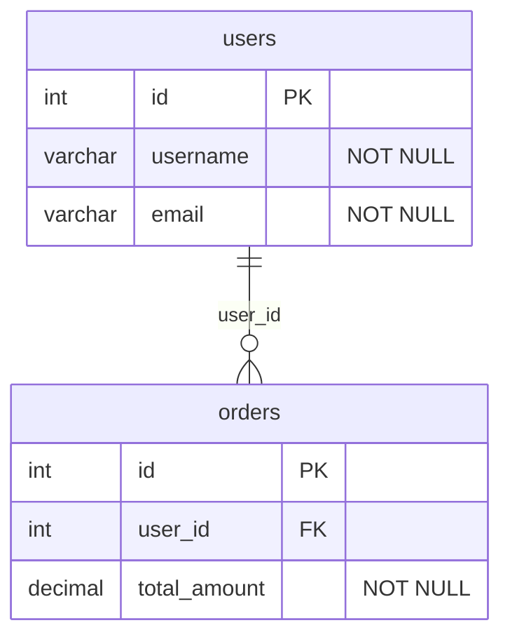

<div align="center">

# 🗄️ Database Explorer MCP Server

### **Let AI assistants talk to your databases.**

Connect **Claude, Cursor, VS Code Copilot, Windsurf** — or any MCP-compatible AI — to **PostgreSQL, MySQL, SQLite, and MongoDB** using natural language.

[](https://opensource.org/licenses/MIT)
[](https://modelcontextprotocol.io)
[](https://www.typescriptlang.org)
[](https://nodejs.org)

[Features](#-features) · [Quick Start](#-quick-start) · [Setup Guides](#-setup-with-your-ai-tool) · [Tools Reference](#-tools-13-total) · [Prompts](#-built-in-prompts) · [Configuration](#️-configuration) · [Contributing](#-contributing)

</div>

---

## 🤔 What is this?

This is a **Model Context Protocol (MCP) server** — a bridge that lets AI assistants interact with your databases directly.

> **Think of it like this:** Instead of you manually writing SQL queries and copy-pasting results to ChatGPT, this server lets the AI connect to your database, explore the schema, run queries, and analyze data — all through natural conversation.

### How it works

```
┌──────────────────┐         ┌─────────────────────────┐         ┌──────────────┐
│   AI Assistant    │   MCP   │   Database Explorer     │   SQL   │   Database   │
│                   │◄───────►│   MCP Server            │◄───────►│              │
│  Claude Desktop   │  JSON   │                         │         │  PostgreSQL  │
│  Cursor           │  over   │  • Explores schemas     │         │  MySQL       │
│  VS Code Copilot  │  stdio  │  • Runs queries         │         │  SQLite      │
│  Windsurf         │         │  • Generates ERDs       │         │  MongoDB     │
│  Any MCP client   │         │  • Suggests indexes     │         │              │
└──────────────────┘         └─────────────────────────┘         └──────────────┘
```

### Who is this for?

- **Developers** who want to query databases using natural language through their AI coding assistant
- **Data analysts** who want AI help exploring and understanding databases
- **Teams** who want to let AI tools safely access their databases (with read-only mode)
- **Anyone** using an MCP-compatible AI tool who works with databases

### ⚠️ Important: This is NOT a standalone tool

This server requires an **MCP-compatible AI client** to use. It does NOT have its own UI.  
The AI client sends commands to this server, and the server talks to your database. See [Setup Guides](#-setup-with-your-ai-tool) below.

---

## ✨ Features

| Feature | Description |
|---------|------------|
| 🔌 **4 Database Engines** | PostgreSQL, MySQL, SQLite, MongoDB |
| 📋 **Schema Explorer** | List tables, describe columns, view indexes, full schema dump |
| ⚡ **Query Execution** | Run SQL or MongoDB queries with auto-LIMIT safety |
| 🔒 **SQL Safety** | Destructive queries (DROP, INSERT, etc.) blocked by default |
| 📊 **Table Statistics** | Row counts, sizes, index info |
| 🔍 **Query Plans** | EXPLAIN queries to debug performance |
| 💡 **Index Suggestions** | Smart recommendations for missing indexes |
| 📤 **Data Export** | Export results as CSV or JSON |
| 🗺️ **ERD Generator** | Generate Mermaid ER diagrams from your schema |
| 🔎 **Data Search** | Full-text search across all tables and columns |
| 🧠 **4 AI Prompts** | Pre-built templates for common database tasks |
| 🔗 **Multi-Connection** | Connect to multiple databases simultaneously |

---

## 🚀 Quick Start

### 1. Clone and build

```bash
git clone https://github.com/YOUR_USERNAME/database-explorer-mcp.git
cd database-explorer-mcp
npm install
npm run build
```

### 2. Add to your AI tool

Choose your AI tool below and add the configuration:

### 3. Start using it!

Just talk to your AI naturally:

> _"Connect to my SQLite database at ~/data/app.db"_  
> _"What tables are in this database?"_  
> _"Show me the first 10 users ordered by signup date"_  
> _"Generate an ER diagram of the schema"_  
> _"Any missing indexes I should add?"_

---

## 🔧 Setup with Your AI Tool

<details>
<summary><b>🟣 Claude Desktop</b></summary>

Edit `~/Library/Application Support/Claude/claude_desktop_config.json` (macOS) or `%AppData%\Claude\claude_desktop_config.json` (Windows):

```json
{
  "mcpServers": {
    "database-explorer": {
      "command": "node",
      "args": ["/FULL/PATH/TO/database-explorer-mcp/build/index.js"],
      "env": {
        "DB_EXPLORER_READONLY": "true"
      }
    }
  }
}
```

Restart Claude Desktop. You'll see the 🔨 tools icon showing 13 available tools.

</details>

<details>
<summary><b>🟢 Cursor</b></summary>

Create `.cursor/mcp.json` in your project root:

```json
{
  "mcpServers": {
    "database-explorer": {
      "command": "node",
      "args": ["/FULL/PATH/TO/database-explorer-mcp/build/index.js"]
    }
  }
}
```

Restart Cursor. The tools will be available in Composer and Chat.

</details>

<details>
<summary><b>🔵 VS Code (GitHub Copilot)</b></summary>

Create `.vscode/mcp.json` in your project:

```json
{
  "servers": {
    "database-explorer": {
      "command": "node",
      "args": ["/FULL/PATH/TO/database-explorer-mcp/build/index.js"]
    }
  }
}
```

Enable MCP in VS Code settings, then use Copilot Chat with `@mcp` to access tools.

</details>

<details>
<summary><b>🌊 Windsurf</b></summary>

Add to your Windsurf MCP configuration:

```json
{
  "mcpServers": {
    "database-explorer": {
      "command": "node",
      "args": ["/FULL/PATH/TO/database-explorer-mcp/build/index.js"]
    }
  }
}
```

</details>

<details>
<summary><b>🛠️ Any MCP Client (Generic)</b></summary>

This server communicates over **stdio** using the standard MCP protocol. Any client that supports MCP over stdio can connect:

```bash
# The server reads from stdin and writes to stdout
node /path/to/database-explorer-mcp/build/index.js
```

Or use the MCP Inspector for testing:

```bash
npx @modelcontextprotocol/inspector node build/index.js
```

</details>

---

## 🛠️ Tools (13 total)

### Connection Management

| Tool | Description |
|------|------------|
| `connect_database` | Connect to PostgreSQL, MySQL, SQLite, or MongoDB |
| `disconnect_database` | Disconnect from a database |
| `list_connections` | List all active connections |

### Schema Exploration

| Tool | Description |
|------|------------|
| `list_tables` | List all tables/views/collections with row counts |
| `describe_table` | Get columns, types, constraints, indexes for a table |
| `get_schema` | Full database schema as structured JSON |
| `generate_erd` | 🆕 Generate Mermaid ER diagram from schema |

### Querying & Analysis

| Tool | Description |
|------|------------|
| `run_query` | Execute SQL or MongoDB queries (read-only by default) |
| `explain_query` | Get query execution plan |
| `search_data` | 🆕 Full-text search across all tables and text columns |

### Optimization & Export

| Tool | Description |
|------|------------|
| `get_table_stats` | Row counts, sizes, index statistics |
| `suggest_indexes` | Smart index optimization recommendations |
| `export_data` | Export query results as CSV or JSON |

---

## 🧠 Built-in Prompts

These prompts appear as suggested starting points in compatible AI clients:

| Prompt | What it does |
|--------|-------------|
| `explore_database` | Automatically explores and explains the entire database structure |
| `optimize_performance` | Analyzes tables for performance issues and suggests fixes |
| `write_query` | Helps you write a query for a specific task |
| `generate_report` | Creates a comprehensive data report on a topic |

---

## 📖 Usage Examples

### Connect to a Database

```
You: Connect to my PostgreSQL database at localhost, database 'myapp', user 'admin', password 'secret'

AI: ✅ Connected to postgresql database "myapp" with alias "default"
```

### Explore Schema

```
You: What tables are in this database?

AI: Database: myapp (postgresql)
──────────────────────────────────────────────────
  • users  [table]  —  12,450 rows  —  4.2 MB
  • orders  [table]  —  89,120 rows  —  28.7 MB
  • products  [table]  —  2,340 rows  —  1.1 MB
  ...
```

### Query Data

```
You: Show me the top 5 customers by total order value

AI: [runs the query automatically]
customer_name │ total_orders │ total_value
──────────────┼──────────────┼────────────
Alice Johnson │ 47           │ $12,450.00
Bob Smith     │ 38           │ $9,870.50
...
```

### Generate ERD

```
You: Generate an ER diagram of the database

AI: [returns Mermaid diagram]
```



### Search Data

```
You: Find any mentions of "alice" across all tables

AI: 🔍 Search results for "alice":
══════════════════════════════════════════════════

📋 users.username — 1 match(es)
  → id: 1 | username: alice | email: alice@example.com

📋 users.email — 1 match(es)
  → id: 1 | username: alice | email: alice@example.com
```

### SQLite (File-based, no server needed)

```
You: Connect to the SQLite database at /path/to/mydb.sqlite
```

### MongoDB

```
You: Connect to MongoDB at localhost, database 'myapp'
You: Find all users older than 25
```

---

## ⚙️ Configuration

Configure via environment variables in your MCP client config:

| Variable | Default | Description |
|----------|---------|-------------|
| `DB_EXPLORER_READONLY` | `true` | Block destructive queries by default |
| `DB_EXPLORER_MAX_ROWS` | `100` | Default row limit for queries |
| `DB_EXPLORER_MAX_ROW_LIMIT` | `1000` | Maximum allowed row limit |
| `DB_EXPLORER_TIMEOUT_MS` | `30000` | Query timeout in milliseconds |

Example with Claude Desktop:

```json
{
  "mcpServers": {
    "database-explorer": {
      "command": "node",
      "args": ["/path/to/build/index.js"],
      "env": {
        "DB_EXPLORER_READONLY": "true",
        "DB_EXPLORER_MAX_ROWS": "200"
      }
    }
  }
}
```

---

## 🔒 Security

- **Read-only by default** — DROP, TRUNCATE, ALTER, INSERT, UPDATE, DELETE are blocked unless `readonly: false` is explicitly passed
- **Auto-LIMIT** — SELECT queries automatically get a LIMIT clause (default 100, max 1000)
- **Query timeout** — 30-second timeout prevents runaway queries
- **No credentials stored** — Connection details are in-memory only, never written to disk
- **Local only** — Uses stdio transport, no network exposure

---

## 🏗️ Project Structure

```
src/
├── index.ts              # Entry point (stdio transport + env config)
├── server.ts             # MCP server setup, tool/prompt/resource registration
├── types.ts              # Shared TypeScript interfaces + SQL safety patterns
├── connection-manager.ts # Connection lifecycle management
├── connectors/
│   ├── base.ts           # Abstract connector interface
│   ├── postgresql.ts     # PostgreSQL (pg driver)
│   ├── mysql.ts          # MySQL (mysql2 driver)
│   ├── sqlite.ts         # SQLite (better-sqlite3)
│   └── mongodb.ts        # MongoDB (mongodb driver)
└── tools/
    ├── connect.ts        # connect/disconnect/list
    ├── schema.ts         # list_tables/describe_table/get_schema
    ├── query.ts          # run_query/explain_query + SQL safety
    ├── stats.ts          # get_table_stats
    ├── optimize.ts       # suggest_indexes
    ├── export.ts         # export_data
    ├── erd.ts            # generate_erd (Mermaid)
    └── search.ts         # search_data
```

---

## 🧪 Testing

Integration tests use SQLite (no external database needed):

```bash
npm test
```

```
✔ connects to SQLite database
✔ lists all tables
✔ describes table with columns and types
✔ describes table with foreign keys
✔ gets indexes for a table
✔ gets full database schema
✔ runs SELECT query
✔ runs JOIN query
✔ runs aggregate query
✔ runs INSERT query (write mode)
✔ explains query plan
✔ gets table stats for all tables
✔ gets table stats for specific table
✔ blocks DROP statements
✔ blocks TRUNCATE statements
✔ blocks ALTER statements
✔ blocks INSERT statements
✔ allows SELECT statements
✔ allows EXPLAIN statements
✔ connects via connection manager
✔ lists connections
✔ throws on missing connection
✔ stores server config

23 pass / 0 fail
```

---

## 🤝 Contributing

Contributions are welcome! Here's how:

1. **Fork** this repository
2. **Create** a feature branch: `git checkout -b feature/amazing-feature`
3. **Commit** your changes: `git commit -m 'Add amazing feature'`
4. **Push** to the branch: `git push origin feature/amazing-feature`
5. **Open** a Pull Request

### Ideas for contributions

- Add support for more databases (Redis, DynamoDB, ClickHouse)
- Add query history tracking
- Add schema diff between connections
- Improve MongoDB aggregation pipeline support
- Add data visualization tools

---

## 📄 License

MIT — see [LICENSE](LICENSE) for details.

---

<div align="center">

**Built with ❤️ for the AI-assisted development community**

If this project helps you, give it a ⭐ on GitHub!

</div>
